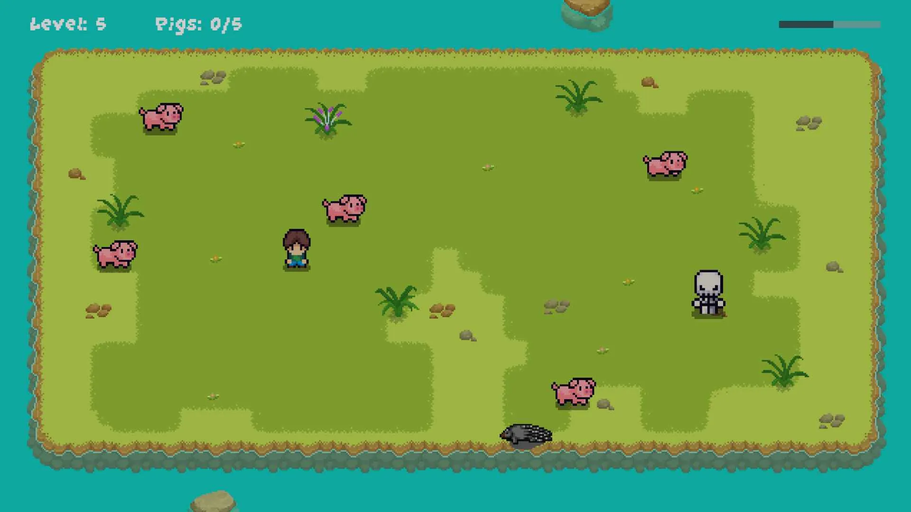

# superVIMus

[Play superVIMus in your browser](https://avollrath.github.io/superVIMus/)

superVIMus is a small puzzle game designed to build muscle memory for the `hjkl` movement keys used in Vim.

The game combines simple box-pushing mechanics with playful pixel graphics and a slightly absurd twist, making it a fun way to practice keyboard navigation.

Built with the Godot engine using GDScript, it explores grid-based movement, level design, and puzzle mechanics.

## What It Is

- A compact puzzle game centered on Vim-style movement
- A playful box-pushing experience with pixel-art presentation
- A Godot project built for quick browser play

## Why It Exists

If you use Vim, learning `hjkl` is mostly about repetition and muscle memory. superVIMus turns that repetition into a small game, giving you a fun way to practice until the movement keys start to feel natural.

## Built With

- Godot
- GDScript
- HTML5/Web export
- Grid-based movement and puzzle mechanics

## Play Online

Try it here:

https://avollrath.github.io/superVIMus/

Sharpen your navigation skills and see how far your Vim movement habits can take you.
